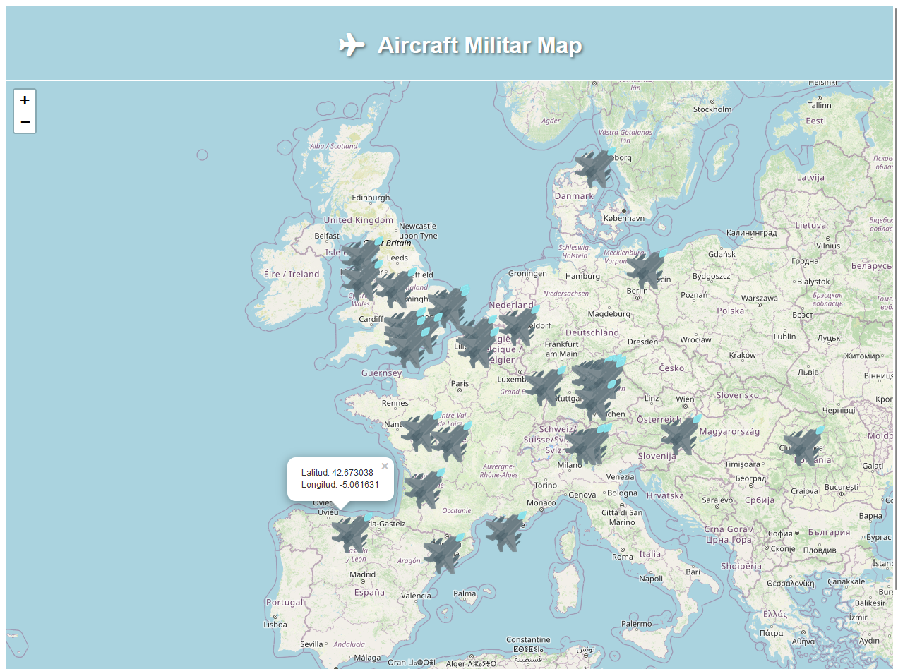
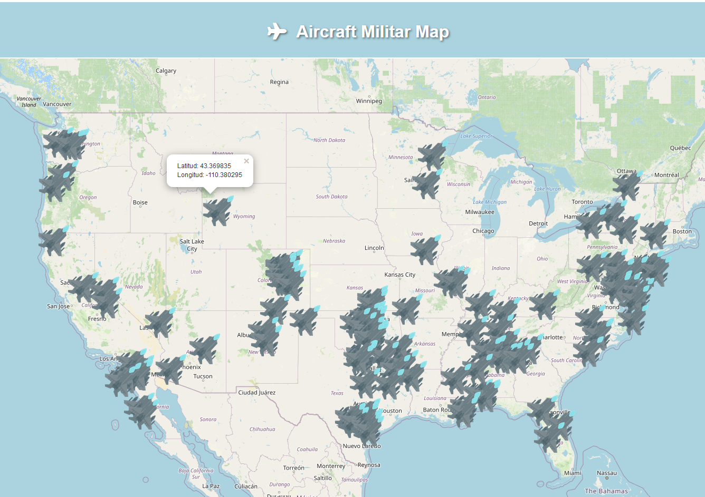

# Aircraft Military Map

## API Consumption:
- Requests are made to the API for real-time data on military aircraft from https://docs.api.facha.dev/
- Data processing: latitude and longitude coordinates from API data.

## Map Visualization:
Leaflet to create an interactive map with markers representing the current locations of military aircraft.

